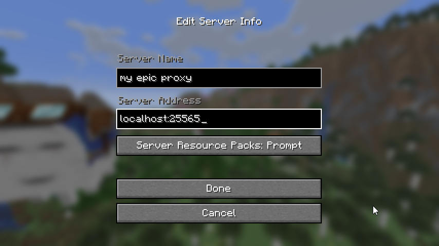
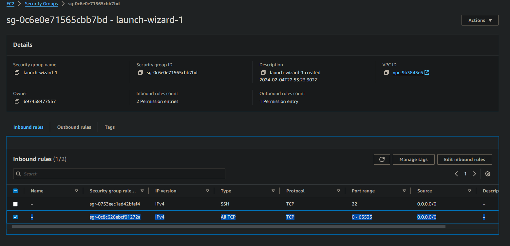

# Frequently Asked Questions (FAQ)

## Switch Accounts

`disconnect`
`auth clear`
`connect`

## Switch the MC server ZenithProxy connects to

`server <address>`

Example: `server connect.2b2t.org`

## I keep getting disconnected from 2b2t!

Refer to the [Disconnects](./Disconnects.md).

In particular, for disconnects like:

> Read timed out.

> Connection closed

> java.net.SocketException: Connection Reset

> io.netty.channel.unix.Errors$NativeIoException: Broken Pipe

These are caused by your internet connection to 2b2t. There is nothing you or I can do to prevent this.

If you have an unstable internet connection, consider hosting on a VPS.

## I don't know how to connect to my proxy!

Run the ZenithProxy command: `status`

Look for `Proxy IP`

Connect to that IP in your MC client



## I can't connect to my proxy!

First step, run the ZenithProxy command: `connectionTest`

If it shows an error related to firewall:

### Oracle Cloud

```bash
sudo iptables -I INPUT -j ACCEPT
sudo su
iptables-save > /etc/iptables/rules.v4
exit

```

source: https://www.reddit.com/r/oraclecloud/comments/r8lkf7/a_quick_tips_to_people_who_are_having_issue/

### AWS

AWS calls their firewall a "Security Group".

Edit it to allow all traffic:



### Other

Consult your provider's website and documentation

## Spammer isn't working on 2b2t

It means you are muted, or your chats are being filtered

Everyone is muted on login until you've walked around a bit

There's also chat filters for banned words and characters

And lastly there are moderators and automated tools who can mute you without warning

## How to set up the pearl loader bot

First, set up pearls with the [pearlLoader](./Commands.md#pearlloader) commands

You can then use ZenithProxy commands to load pearls.

To be able to use the commands ingame while not connected to ZenithProxy:

### Option 1: Whisper Commands

Use the [ZenithProxyChatControl](https://github.com/rfresh2/ZenithProxyChatControl) plugin

### Option 2: ZenithProxyMod + ZenithProxyWebAPI

Use the [ZenithProxyWebAPI](https://github.com/rfresh2/ZenithProxyWebAPI/) plugin

and [ZenithProxyMod](https://github.com/rfresh2/ZenithProxyMod/)

Load pearls over the API [with this command](https://github.com/rfresh2/ZenithProxyMod#web-api-commands)

## Can I ZenithProxy run while my PC is off?

No.

You can use a spare computer kept on all the time, or you can run ZenithProxy on a [VPS](./DigitalOcean-Setup-Guide.md).

## How can I make my Xaero map work while using ZenithProxy?

By default, Xaero chooses which map files to use based on the server IP.

You can find the map files currently in use with the XaeroPlus commands:

`/xaeroDataDir` and `/xaeroWaypointDir`

The issue is ZenithProxy has a different IP than connecting directly to 2b2t (or other servers).

### Option 1: Change Data Dir Mode

XaeroPlus has a setting: `Xaero Data Dir Mode` you can set to `Server Name`. (in the `XaeroPlus WorldMap Settings` page)

"Server Name" meaning the name you set up in your ingame server list.

So, if you set up your servers all with the same name, they will all use the same map/waypoints folder.

You will need to manually copy/move your existing map/waypoint files to the new folder.

### Option 2: Symlinks

A symlink is like a shortcut to a folder. Meaning you can forward one folder to another.

So, you can symlink the map/waypoint folders used by each ZenithProxy IP to your main map/waypoint folders.

More info in my discord: https://discord.com/channels/1127460556710883391/1127461243054202921/1272355246206619711


